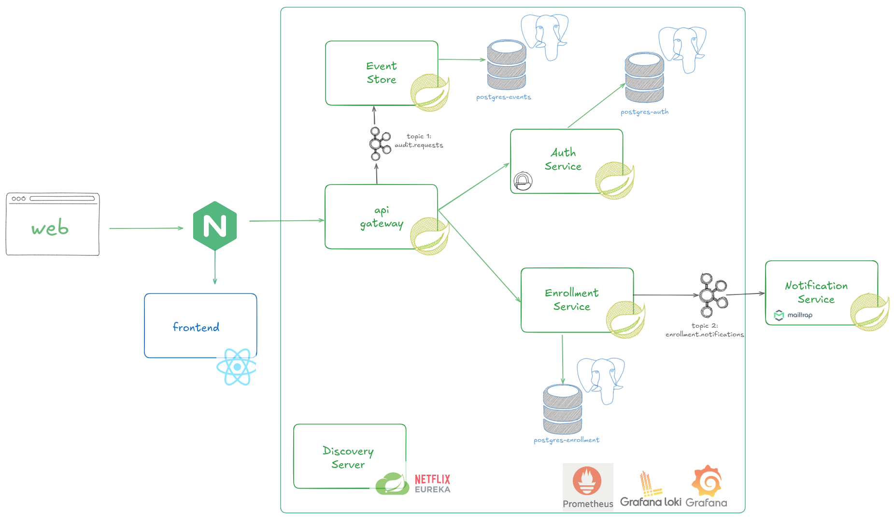

# 📚 Enrollment System – Microservices Architecture

Sistema de **gestión académica y matrícula universitaria** implementado como una **arquitectura de microservicios**, con enfoque en seguridad, desacoplamiento por eventos y buenas prácticas de diseño.

El sistema permite administrar **facultades, carreras, cursos, periodos académicos (terms), cursos en vigencia (course offerings)** y la **inscripción de estudiantes**, integrando autenticación segura y comunicación asíncrona basada en eventos.

---

## 🧱 Arquitectura General

* **Arquitectura de Microservicios**
* **API Gateway** como punto de entrada único
* **Service Discovery** con Netflix Eureka
* **Comunicación síncrona**: REST
* **Comunicación asíncrona**: Apache Kafka
* **Persistencia por servicio** (Database per Service)
* **Seguridad centralizada** (OAuth2 + JWT + MFA)
* **Arquitectura orientada a eventos** para auditoría y notificaciones




---

## 🛠️ Tecnologías Utilizadas

### Backend

* **Java 17**
* **Spring Boot**
* **Spring Web**
* **Spring Data JPA**
* **Spring Security**
* **Spring Cloud Gateway**
* **Spring Cloud Netflix Eureka**
* **Spring Kafka**

### Frontend

* **React**
* **TypeScript**
* **Vite**
* **Tailwind CSS**
* **Shadcn/UI**

### Infraestructura

* **Docker**
* **Docker Compose**
* **PostgreSQL**
* **Apache Kafka**
* **Zookeeper**

### Observabilidad (opcional)

* **Prometheus**
* **Grafana**

---

## 📦 Microservicios

| Servicio                 | Responsabilidad                        |
| ------------------------ | -------------------------------------- |
| **api-gateway**          | Punto de entrada, routing, seguridad   |
| **authorization-server** | Autenticación, OAuth2, JWT, MFA, roles |
| **enrollment-server**    | Dominio académico y matrículas         |
| **event-store-server**   | Almacenamiento de eventos/auditoría    |
| **notification-server**  | Envío de notificaciones                |
| **discovery-server**     | Registro y descubrimiento de servicios |

---

## 🔐 Seguridad

* Autenticación con **OAuth2** (GitHub / Google)
* **JWT** para sesiones
* **MFA (2FA)** como segundo factor
* Autorización basada en **roles y permisos**
* Validación centralizada en API Gateway

---

## 📡 Arquitectura Basada en Eventos

Se utiliza **Kafka** para desacoplar procesos secundarios:

* Registro de auditoría (requests HTTP)
* Notificaciones
* Eventos de dominio (ej. inscripción a cursos)

**No todos los eventos usan Outbox**, solo los críticos del dominio.
Los eventos técnicos (auditoría) se generan mediante interceptores/filtros.

---

## 🚀 Levantar el proyecto en local

### Requisitos

* Docker
* Docker Compose
* Java 17 (opcional, solo si corres fuera de Docker)
* Node.js 18+ (para frontend)

---

### 1️⃣ Clonar el repositorio

```bash
git clone https://github.com/SebastianLl28/enrollment-system-microservices.git
cd enrollment-system-microservice
```

---

### 2️⃣ Configurar variables de entorno

Copia el archivo de ejemplo:

```bash
cp .env.example .env
```

### 📄 Ejemplo de `.env`

```env
# ================== POSTGRES ENROLLMENT ==================
DB_USER=enrollment_user
DB_PASSWORD=enrollment_password
DB_NAME=enrollment_db
DB_HOST=db-postgres-enrollment
DB_PORT=5432
DB_PORT_EXTERNAL=5432

# ================== POSTGRES AUTH ==================
DB_AUTH_USER=auth_user
DB_AUTH_PASSWORD=auth_password
DB_AUTH_NAME=auth_db
DB_AUTH_HOST=db-postgres-auth
DB_AUTH_PORT=5432
DB_AUTH_PORT_EXTERNAL=5433


# ================== POSTGRES EVENTS ==================
DB_EVENTS_USER=events_user
DB_EVENTS_PASSWORD=events_password
DB_EVENTS_NAME=events_db
DB_EVENTS_HOST=db-postgres-events
DB_EVENTS_PORT=5432
DB_EVENTS_PORT_EXTERNAL=5434


EUREKA_PORT=8761
DISCOVERY_HOST=discovery-server

EUREKA_URI=http://discovery-server:${EUREKA_PORT}/eureka

API_GATEWAY_PORT=8080

# ================== JWT / SEGURIDAD ==================
JWT_SECRET=
JWT_EXPIRATION=36000000
TWO_FACTOR_EXPIRATION=300000
TWO_FACTOR_ISSUER=EnrollmentApp

#FRONTEND_URL=http://localhost:5173
#OAUTH2_PUBLIC_BASE_URL=http://localhost:${API_GATEWAY_PORT}

GITHUB_CLIENT_ID=
GITHUB_CLIENT_SECRET=
#GITHUB_REDIRECT_URI=http://localhost:${API_GATEWAY_PORT}/login/oauth2/code/github

GOOGLE_CLIENT_ID=asdasd
GOOGLE_CLIENT_SECRET=asdasdasdasd
#GOOGLE_REDIRECT_URI=http://localhost:${API_GATEWAY_PORT}/login/oauth2/code/google


KAFKA_BOOTSTRAP_SERVERS=kafka:9092

KAFKA_ENROLLMENT_EVENTS_TOPIC=enrollment.notifications
KAFKA_AUDIT_LOGS_TOPIC=audit.requests


PROMETHEUS_PORT=9090
GRAFANA_PORT=3000

MAIL_HOST=sandbox.smtp.mailtrap.io
MAIL_PORT=2525
MAIL_USERNAME=
MAIL_PASSWORD=
MAIL_FROM=admin@coursehub.com

KAFKA_CONSUMER_GROUP_ID=event-store-consumer
KAFKA_AUTO_OFFSET_RESET=earliest


FRONTEND_URL=http://localhost
OAUTH2_PUBLIC_BASE_URL=http://localhost
GITHUB_REDIRECT_URI=http://localhost/login/oauth2/code/github
GOOGLE_REDIRECT_URI=http://localhost/login/oauth2/code/google

GRAFANA_ADMIN_USER=admin
GRAFANA_ADMIN_PASSWORD=admin
GRAFANA_SERVER_ROOT_URL=http://localhost/grafana/

PROMETHEUS_EXTERNAL_URL=http://localhost/prometheus
AUTH_DB_HOST=db-postgres-auth
AUTH_DB_PORT=5432
AUTH_DB_USER=auth_user
AUTH_DB_PASSWORD=auth_password
AUTH_DB_NAME=auth_db
```

---

### 3️⃣ Levantar todo con Docker

```bash
make up
```

O directamente:

```bash
docker compose up -d --build
```

---

### 4️⃣ Accesos principales

| Servicio          | URL                                                                            |
| ----------------- |--------------------------------------------------------------------------------|
| API Gateway       | [http://localhost:8080](http://localhost:8080)                                 |
| Eureka            | [http://localhost:8761](http://localhost:8761)                                 |
| Swagger (Gateway) | [http://localhost:8080/swagger-ui.html](http://localhost:8080/swagger-ui.html) |
| Frontend          | [http://localhost:5173](http://localhost)                                      |
| Grafana           | [http://localhost:3000](http://localhost:3000)                                 |

---

## 📐 Buenas Prácticas Aplicadas

* Clean Architecture
* Separación de responsabilidades
* Database per Service
* Event-driven architecture
* Gateway Pattern
* Service Discovery
* Seguridad centralizada
* Consistencia eventual
* Escalabilidad horizontal

---

## 📄 Documentación

* Diagramas de arquitectura
* ADRs (Architectural Decision Records)
* Documento de Arquitectura de Software
* Swagger/OpenAPI

---

## 🧑‍🎓 Contexto Académico

Proyecto desarrollado como **Trabajo Tipo 1 – Desarrollo y Arquitectura**, enfocado en:

* Microservicios
* Clean Architecture
* Seguridad
* Contenerización
* Despliegue en la nube
